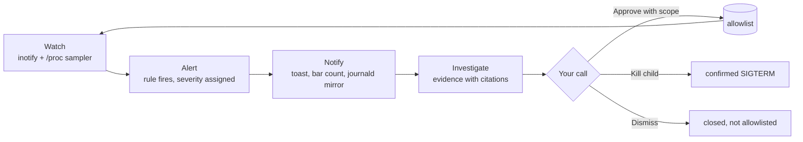

# Omarchy Sentinel

[](https://github.com/tavarelu/omarchy-sentinel/actions/workflows/ci.yml)
[](LICENSE)
[](pyproject.toml)
[](pyproject.toml)
[](manifest.json)

**A user-space watchdog for the AI coding agents on your machine.**

> ### Mission
> This computer stays the user's. Agents are first-class on Omarchy — visible, steerable,
> stoppable — not an invisible second user.

Sentinel runs beside Claude Code, Codex, Gemini CLI, Grok Build or Cursor and stays silent while
they do ordinary work. It speaks up only when the *shape* of a session changes: an agent was
started with permission-skipping flags, something rewrote an agent's hooks or settings, an agent
spawned an interactive shell or piped `curl` into `bash`, or something touched Sentinel itself.
You answer from the bar or from a notification — **Approve** with a scope, **Kill** the child,
**Investigate** the evidence, or **Dismiss** — and the daemon remembers your answer.

It runs as you, never as root. It records metadata only: paths, hashes, process names and
redacted command lines. It never opens transcripts, credentials or settings bodies, and it never
calls a cloud model unless you click Summarize.

> **Status:** 0.1 release candidate. The plugin and daemon are under active review; what is
> verified, merged and live is tracked in [`docs/collab/LEDGER.md`](docs/collab/LEDGER.md).

## What it watches

| Signal | What Sentinel notices | Rule |
|---|---|---|
| **Process tree** | An agent launched with a bypass flag (`--dangerously-skip-permissions`, `--yolo`, `--dangerously-bypass-approvals-and-sandbox`, …), or a child that is an interactive shell, a `curl \| bash`, or a bare network helper. Argv is redacted before it is stored. | `R-BYPASS`, `R-CHILD-SHELL` |
| **Filesystem** | A write to the files that control an agent — hooks, MCP config, settings — by something other than the agent's own vendor tooling. The watchlist is built from a per-vendor table, not by guessing. | `R-HOOK-WRITE` |
| **Self-defense** | A write to Sentinel's own state that Sentinel did not make or announce, a pause pushed past its cap, an attempt to pre-approve tamper alerts. These are sticky: they ignore pause and preferences. | `R-SELF` |

## How it works



One loop, every time. The daemon watches, a rule fires, you decide, and the decision feeds the
allowlist so the same pattern in the same scope stays quiet next time. Bursts are summarized
rather than spammed, and a pause has a hard 24-hour ceiling.

```mermaid
flowchart TB
    subgraph Daemon["sentinel (systemd --user service)"]
        IN[inotify watches] --> R[rules]
        PS[/proc sampler] --> R
        R --> S[(alerts.jsonl<br/>0600 in 0700)]
        R --> J[journald mirror<br/>append-only]
        CS[control socket<br/>AF_UNIX, SO_PASSCRED] --> L[state ledger]
    end
    S --> BW[Bar widget<br/>count, panel, filters]
    S --> T[Notification<br/>click opens the alert]
    BW --> SA[sentinel-action<br/>approve · kill · investigate · dismiss · pause]
    T --> SA
    SA -->|announces its writes| CS
    SC[sentinel-scan<br/>sandboxed skill scanner] -->|sanitized report| S
```

## What it never does

- **Run as root.** Sentinel sees exactly what your own user session can see.
- **Read your code, credentials or transcripts.** Auth-classified files are watched but never
  opened; only paths, hashes, sizes and redacted argv are stored.
- **Call the network from the daemon.** The only outbound call in the tree is the opt-in Summarize
  helper, which you trigger by hand.
- **Kill anything on its own.** Every kill is a confirmed action you take; `precious_worktrees`
  adds a second confirmation for whole-session kills in the directories you name.
- **Go quiet without a trace.** Every alert is mirrored to the systemd user journal, tampering
  with Sentinel's state raises a sticky alert, and a pause cannot exceed 24 hours.

## Install

```sh
omarchy plugin add https://github.com/tavarelu/omarchy-sentinel.git --enable
```

That adds the bar widget. Open it and click **Install daemon**, or run the same thing by hand:

```sh
~/.config/omarchy/plugins/tav.sentinel/scripts/install-daemon.sh          # dry-run, shows every step
~/.config/omarchy/plugins/tav.sentinel/scripts/install-daemon.sh --apply
```

The installer creates a Python venv under `~/.local/share/tav.sentinel/`, puts `sentinel`,
`sentinel-action` and `sentinel-scout` in `~/.local/bin`, installs the systemd user
units, runs one metadata inventory, and enables the nightly inventory timer. It deliberately does
not start the daemon. When you are ready:

```sh
systemctl --user enable --now sentinel.service
```

Optional, and the most precise detection of bypass flags: wrap the agent launchers.

```sh
~/.config/omarchy/plugins/tav.sentinel/scripts/install-wrappers.sh claude codex
```

The wrapper installer backs up anything it replaces and refuses to finish if its shim would be
shadowed by something earlier on your login `PATH` — it prints both fixes instead of pretending.

## Usage

- The bar shows a shield and the number of open alerts. It turns urgent when a high-severity alert
  is open, and dims while notifications are paused.
- Left click opens the panel. Middle click pauses notifications for an hour. Right click lists
  alerts in a terminal.
- In the panel: **Approve** allows this pattern in the current repository, or writes to this file
  for write alerts; **Anywhere** allows it everywhere and never expires; **Kill** opens a terminal
  that confirms before signalling the child process; **Investigate** opens the evidence view;
  **Dismiss** closes the alert without allowlisting. The folder icon on a card opens the alerted
  path in the file manager; the folder icon in the header opens the log directory.
- **High / Medium / Low** chips filter the list and decide which severities toast. The setting is
  shared with the daemon through `sentinel-action notify` and persists. Tamper alerts always show.
- Keys: `j` `k` move, `a` `A` approve, `x` kill, `i` investigate, `d` dismiss, `o` open folder,
  `1` `2` `3` toggle severities, `p` pause, `r` refresh.
- Notifications carry the same actions: click one to open the alert in a floating terminal.
- Command line: `sentinel-action list`, `sentinel-action <id> approve --scope session|24h|this-repo|forever`,
  `sentinel-action <id> kill [--session]`, `sentinel-action <id> investigate`,
  `sentinel-action <id> dismiss`, `sentinel-action pause 1h`, `sentinel-scout --refresh`.

### Scanning a skill before you install it

`sentinel-scan <dir>` runs [NVIDIA SkillSpector](https://github.com/NVIDIA/skillspector) over a
skill or plugin directory inside a sandbox (a transient user service with no network and a
read-only view of the target, or `unshare -rn` where that is unavailable) and stores a
**sanitized** report — findings and scores, never the scanned source — under
`~/.local/state/sentinel/scans/`. `sentinel-scan` ships in the plugin venv (`~/.local/share/tav.sentinel/venv/bin/sentinel-scan`); the
scanner itself is optional and lives in a separate venv: `scripts/install-scanner.sh --dry-run`
shows the steps.

## Configure

- Plugin settings live in the bar's widget settings: the path to `sentinel-action` if it is not on
  `PATH`. Which severities show and toast is set from the panel chips or
  `sentinel-action notify --severity low=on`.
- Daemon settings live in `~/.config/sentinel/config.toml`: sampler interval, extra bypass flags,
  known agent names, `[notify] pause_max` (default `24h`), and `precious_worktrees`, the
  directories where killing a whole agent session requires a second confirmation.
- Move the widget: `omarchy bar move tav.sentinel --section right`.

## Remove

```sh
systemctl --user disable --now sentinel.service sentinel-inventory.timer
omarchy plugin remove tav.sentinel
rm -rf ~/.local/share/tav.sentinel ~/.local/bin/sentinel ~/.local/bin/sentinel-action ~/.local/bin/sentinel-scout
rm -f ~/.config/systemd/user/sentinel*.service ~/.config/systemd/user/sentinel*.timer && systemctl --user daemon-reload
```

State stays in `~/.local/state/sentinel/` and config in `~/.config/sentinel/` until you delete
them; both contain only metadata.

## Security

Sentinel is a visibility and decision tool, not a sandbox. It cannot stop a process that has
already escalated to root, and a skill that passed a scanner can still misbehave until Sentinel
sees it act. Pair it with a pre-install scan (`sentinel-scan`) and, when you need containment, a
sandbox. Vulnerabilities: see [`SECURITY.md`](SECURITY.md) — reports go through GitHub's private
vulnerability reporting, not public issues.

### Self-defense: tamper evidence, not prevention

Every stored alert is mirrored, append-only, to the systemd user journal
(`journalctl --user -t sentinel`), so an agent that rewrites `alerts.jsonl` cannot erase the
record. A write to any of Sentinel's own state files that Sentinel itself did not make — or
announce over its local control socket — raises a sticky `R-SELF` alert that ignores pause,
per-severity prefs, and burst summarization. `sentinel-action pause` is capped at 24 h
(`[notify] pause_max`); a `pause_until` written beyond the cap, however it got there, is treated
as invalid and raises its own sticky alert instead of silently muting Sentinel.

None of this is prevention. Any same-uid process — exactly the adversary Sentinel watches for —
can forge a correctly-hashed announcement over the control socket and be classified "ours". What
it cannot do is make that forgery invisible: every announcement is received with `SO_PASSCRED`
and mirrored to the journal with the sender's pid (`SENTINEL_EVENT=cli-announce`), so a forged
announcement still leaves a trail pointing at the process that sent it. Sandboxing an agent so it
cannot touch Sentinel's state at all is a separate, future goal, not this one.

## Track A: T2 MacBook health

The same repo carries Omarchy hooks and a timer that check the fan daemon, wifi and disk after
boot and after updates, and warn only after three consecutive failures. Install with
`scripts/install-track-a.sh --dry-run` first. This half is specific to Apple T2 machines running
Omarchy and is optional.

## Development

```sh
python -m venv .venv && source .venv/bin/activate
pip install -e ".[dev]"
pytest -q                          # unit + black-box acceptance + adversarial harness
omarchy plugin validate .          # run on a clean checkout; the validator refuses symlinks such as .venv
```

Three suites run together and all must stay green: the unit and integration tests, a black-box
acceptance suite written from the spec rather than the code (`tests/acceptance/`), and an
adversarial harness driven by JSON cases (`tests/joint/`). The daemon is also scanned with
SkillSpector against a per-finding baseline
([`docs/collab/reviews/SKILLSPECTOR-SELF-SCAN.md`](docs/collab/reviews/SKILLSPECTOR-SELF-SCAN.md)).

How the project is built — packets with numbered, checkable claims, reviewed by agent squads under
one human owner — is described in [`docs/collab/PROTOCOL.md`](docs/collab/PROTOCOL.md). The design
spec is [`docs/superpowers/specs/2026-09-03-omarchy-sentinel-design.md`](docs/superpowers/specs/2026-09-03-omarchy-sentinel-design.md)
and the plan to v1.0 is [`docs/collab/ROADMAP.md`](docs/collab/ROADMAP.md).

## Contributing

Bug reports and pull requests are welcome; read [`CONTRIBUTING.md`](CONTRIBUTING.md) first — it
is short, and most of it is the list of things Sentinel must never do.

## License

Apache-2.0. See [`LICENSE`](LICENSE) and [`NOTICE`](NOTICE).
